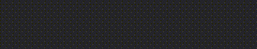

# bevy_text_animation

[](https://crates.io/crates/bevy_text_animation)
[](https://docs.rs/bevy_text_animation)
[](LICENSE)



text animation library for Bevy, just like typewriter effect.

see [examples](examples) for usage.

## Versions

| bevy | bevy_text_animation |
|------|---------------------|
| 0.15 | 0.3                 |
| 0.14 | 0.2                 |
| 0.13 | 0.1                 |

## Usage

### simple.rs

```rust
use bevy::prelude::*;
use bevy_text_animation::{TextAnimationFinished, TextAnimatorPlugin, TextSimpleAnimator};

fn main() {
    App::new()
        .add_plugins(DefaultPlugins)
        .add_plugins(TextAnimatorPlugin)
        .add_systems(Startup, setup)
        .add_systems(Update, key_handler)
        .add_systems(Update, event_handler)
        .run();
}

fn setup(
    mut commands: Commands,
) {
    commands.spawn(Camera2d::default());

    commands.spawn((
        Text2d::new(""),
        TextFont {
            font_size: 60.0,
            ..default()
        },
        TextColor(Color::WHITE),
    )).insert(TextSimpleAnimator::new("Hello, World!", 8.0));
}

fn key_handler(
    keyboard_input: Res<ButtonInput<KeyCode>>,
    mut query: Query<&mut TextSimpleAnimator>,
) {
    for mut animator in query.iter_mut() {
        if keyboard_input.just_pressed(KeyCode::Space) {
            animator.play();
        }
    }
}

fn event_handler(
    mut events: EventReader<TextAnimationFinished>,
) {
    for event in events.read() {
        println!("Text Animation finished for entity (id: {:?})", event.entity);
    }
}
```

## TODOs

- multiple sections
- alpha color animation
